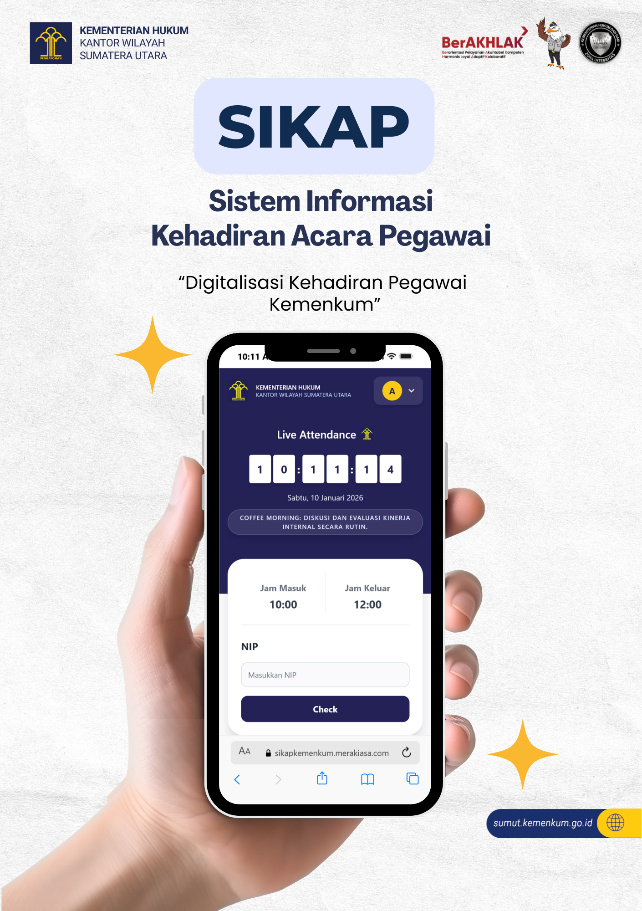

# SIKAP-Kemenkum-Kanwil-Sumut

# SIKAP (Sistem Informasi Kehadiran Acara Pegawai)

Sistem Informasi Kehadiran Acara Pegawai adalah aplikasi web untuk mengelola kehadiran pegawai dalam berbagai acara. Dibangun dengan Laravel dan Filament untuk antarmuka admin yang mudah digunakan.

## Tech Stack

- **Laravel 10**
- **MySQL Database**
- **Filament 2** (untuk admin panel)

## Features

- Manajemen Pegawai (CRUD)
- Manajemen Absensi
- Manajemen Kegiatan
- Manajemen Lokasi Absensi
- Import data pegawai
- Dashboard admin dengan Filament

## Installation

Ikuti langkah-langkah berikut untuk mengkloning dan menjalankan proyek di lingkungan lokal Anda:

1. Clone repository:

    ```bash
    git clone <url-repo-anda>
    ```

2. Install dependencies menggunakan Composer dan NPM:

    ```bash
    composer install
    npm install
    ```

3. Copy file `.env.example` ke `.env`:

    ```bash
    cp .env.example .env
    ```

4. Generate application key:

    ```bash
    php artisan key:generate
    ```

5. Setup database di file `.env`:

    ```plaintext
    DB_CONNECTION=mysql
    DB_HOST=127.0.0.1
    DB_PORT=3306
    DB_DATABASE=sikap
    DB_USERNAME=root
    DB_PASSWORD=
    ```

6. Run migration database:

    ```bash
    php artisan migrate
    ```

7. (Opsional) Run seeder database jika ada:

    ```bash
    php artisan db:seed
    ```

8. Jalankan website:

    ```bash
    npm run dev
    php artisan serve
    ```

## Penggunaan
# SIKAP - Sistem Informasi Kehadiran Acara Pegawai
**Kementerian Hukum - Kantor Wilayah Sumatera Utara**



**SIKAP** adalah sistem informasi berbasis web yang dikembangkan untuk mendigitalkan proses absensi kegiatan atau acara di lingkungan Kemenkum Kanwil Sumatera Utara. Sistem ini menggantikan absensi manual kertas dengan sistem tanda tangan digital dan validasi kehadiran yang lebih akurat dan *real-time*.

Aplikasi ini dibagi menjadi dua modul utama:
1.  **Panel Admin:** Untuk pengelolaan data pegawai, kegiatan, lokasi, dan rekapitulasi absensi.
2.  **Panel Pegawai:** Antarmuka khusus pegawai untuk melakukan absensi saat kegiatan berlangsung.

---

## Fitur Utama

### 👑 Administrator
Admin memiliki kontrol penuh terhadap sistem dengan fitur sebagai berikut:

* **Dashboard Statistik:** Tampilan visual data kehadiran bulanan, total kegiatan, dan jumlah pegawai per divisi.
* **Manajemen Kegiatan:** Membuat acara baru, mengatur jadwal, dan *generate* QR Code untuk absensi.
* **Manajemen Pegawai:** Pengelolaan data pegawai (CRUD) dengan fitur *Import Excel* untuk kemudahan input data massal.
* **Lokasi Absensi:** Pengaturan titik lokasi (Latitude/Longitude) dan radius absensi untuk membatasi area check-in.
* **Riwayat & Rekap Absensi:** Memantau siapa yang hadir, melihat tanda tangan digital, serta fitur **Export PDF** untuk laporan kegiatan.

### 👨‍💼 Pegawai (User)
Tampilan antarmuka yang sederhana untuk memudahkan proses kehadiran:

* **Cek Kegiatan:** Melihat jadwal kegiatan yang aktif pada hari tersebut.
* **Absensi Digital:** Melakukan absensi dengan memasukkan NIP dan membubuhkan **Tanda Tangan Digital** langsung pada perangkat.
* **Status Kehadiran:** Setelah melakukan submit, data akan di rekam dan tersimpan otomatis.
